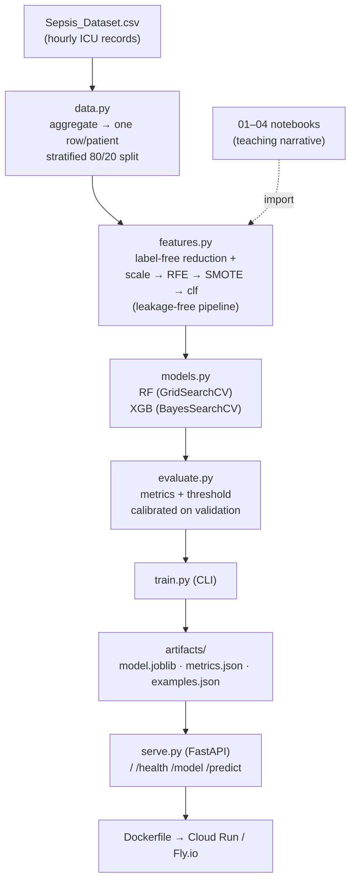

# Sepsis Early Prediction — ICU Machine Learning Project


**Predicts which ICU patients developed sepsis from their vital-sign and lab records — delivered as both a four-notebook teaching series and a deployable FastAPI service with a live demo.**

### 🔗 Live demo: **[sepsis-icu-classifier.fly.dev](https://sepsis-icu-classifier.fly.dev)**  ·  [API docs](https://sepsis-icu-classifier.fly.dev/docs)  ·  [/model](https://sepsis-icu-classifier.fly.dev/model)

Deployed on Fly.io (scales to zero — the first request after idle takes a few seconds to cold-start).

---

## Recruiter TL;DR

- **What it does** — Trains and serves a classifier that flags sepsis in ICU patients from aggregated vital-sign / lab summaries (PhysioNet/CinC 2019, 40,336 patients). One codebase, two front-ends: step-by-step learning notebooks *and* a production-style REST API with an interactive demo page.
- **Hardest problem solved** — Building an *honest* imbalanced-classification pipeline (~7% sepsis rate) with **no leakage**: feature selection and SMOTE oversampling run **inside** cross-validation, and the decision threshold is calibrated on a validation split — never the test set.
- **Best held-out result** — XGBoost **F1 = 0.660, ROC-AUC = 0.919** on the 8,068-patient held-out test set (371/586 sepsis cases caught), generated reproducibly by a single `python train.py`. Random Forest: F1 = 0.631, ROC-AUC = 0.915.

---

## Overview

Sepsis — the body's dysregulated, organ-damaging response to infection — is a leading cause of hospital death, and every hour of delayed treatment raises mortality. ICU patients have vitals and labs recorded hourly, producing a rich clinical time-series. This project asks: **from those measurements, can a model identify which patients developed sepsis?**

It was built as a **teaching project** (to learn the full applied-ML workflow end to end) and hardened into a **portfolio piece** (to demonstrate production ML engineering, not just a notebook). Both audiences are served from one codebase:

| I want to… | Start here |
|---|---|
| **Learn** the pipeline step by step | The four Jupyter notebooks (`01`–`04`), each explained in plain language |
| **Run / deploy** it reproducibly | The `sepsis_icu` package + `train.py` CLI + FastAPI service |

> **Scope note.** The raw data is a time-series; the most powerful approach would be a sequence model (LSTM/Transformer). This project deliberately collapses each stay into one row via statistical aggregations and uses tabular classifiers (Random Forest, XGBoost) — a pedagogical choice. **A consequence: because features summarise the *whole* stay, this is a retrospective whole-stay classifier, not a real-time early-warning system** (see [Limitations](#limitations)).

---

## Features

- **End-to-end reproducible pipeline** — raw hourly CSV → per-patient aggregation → leakage-free feature selection → tuned RF & XGBoost → calibrated threshold → saved model, all in one `python train.py`.
- **Two tuned models, honestly compared** — Random Forest (GridSearchCV) and XGBoost (Bayesian optimisation), evaluated identically on the same held-out test set.
- **Imbalance handled correctly** — SMOTE inside CV, F1-first evaluation, and a decision threshold tuned on validation.
- **FastAPI serving layer** — `/predict`, `/health`, `/model`, auto-generated OpenAPI docs at `/docs`, and an interactive HTML demo that runs real held-out patients through the live model.
- **Production tooling** — containerized (Docker), deploy configs (Fly.io / Cloud Run), CI (GitHub Actions), structured JSON prediction logs, and a `pytest` suite that runs without the dataset.

---

## Architecture

The notebooks and the training CLI import the **same** package modules, so there is exactly one implementation of every step. The notebooks are the readable narrative; the package is the source of truth. Full write-up and Architecture Decision Records in [`docs/architecture.md`](docs/architecture.md).



**Why this shape?** The original notebooks worked but had three issues a reviewer would flag: feature selection and threshold choice leaked test information, and the code only ran on Colab. Refactoring the logic into a package let the fixes live in one place — selection + SMOTE inside CV, threshold on a validation split, and config-driven Colab/local portability — while the notebooks stay as the teaching front-end. Serving a *compact* model (only the ~50 selected features, not all 173) keeps the API contract small.

---

## Tech Stack

| Layer | Choice | Why |
|---|---|---|
| Data / numerics | pandas, numpy | Standard for tabular ETL and aggregation |
| ML | scikit-learn (RF, RFE, pipelines, GridSearchCV) | Core modelling + leakage-free `Pipeline` |
| Gradient boosting | XGBoost | Strong tabular baseline; the winning model |
| Imbalance | imbalanced-learn (SMOTE) | Oversampling **inside** the CV pipeline (needs imblearn's `Pipeline`) |
| Tuning | scikit-optimize (`BayesSearchCV`) | Searches continuous ranges with fewer fits than grid search; falls back to `RandomizedSearchCV` if absent |
| Serving | FastAPI + Uvicorn + Pydantic | Typed request/response, free OpenAPI docs, async-ready |
| Packaging / infra | setuptools, Docker, Fly.io / Cloud Run, GitHub Actions | Reproducible install, containerized deploy, CI |

Exact versions are pinned in [`requirements.txt`](requirements.txt); the package's dependency ranges are in [`pyproject.toml`](pyproject.toml). The stack is pinned around `scikit-optimize`'s scikit-learn ceiling, so bump versions together rather than individually.

---

## Skills Demonstrated

- **Production ML / MLOps** — serving layer fully separate from training/notebook code; versioned model artifact baked into the container.
- **RESTful API design** — FastAPI with 4 endpoints + interactive demo; typed Pydantic contracts; OpenAPI docs.
- **Data engineering / ETL** — hourly time-series → one-row-per-patient aggregation (173 engineered features) with median imputation and variance filtering.
- **Imbalanced classification** — SMOTE, F1-over-accuracy framing, threshold calibration for a ~7% positive rate.
- **Leakage-free model selection** — RFE + SMOTE inside cross-validation; threshold chosen on a held-out validation split.
- **Containerization & Docker** — slim serving image, non-default resource sizing, container healthcheck.
- **CI/CD** — GitHub Actions running tests on Python 3.11 & 3.12 plus a serve-import smoke check.
- **Observability** — structured JSON prediction logs + `/health` readiness probe.
- **Test-driven development** — `pytest` suite (aggregation, features, pipeline, API) that runs without the dataset via synthetic fixtures.
- **System design** — documented architecture + ADRs.

---

## Quickstart

### Option A — run the production pipeline locally

```bash
git clone https://github.com/shiva-shivanibokka/Sepsis-ML-Model.git
cd Sepsis-ML-Model
python -m venv .venv && source .venv/bin/activate    # Windows: .venv\Scripts\activate
pip install -e ".[serve,train,dev]"

# Place Sepsis_Dataset.csv in the repo root, or: export SEPSIS_DATA_DIR=/path/to/folder
python train.py                  # trains RF + XGB, writes artifacts/
uvicorn sepsis_icu.serve:app --reload
# → http://127.0.0.1:8000  (demo)     http://127.0.0.1:8000/docs  (API)
```

`train.py` flags: `--xgb-iters` (Bayesian search budget), `--variance-threshold`, `--demo-samples`. It writes `artifacts/model.joblib`, `metrics.json`, and `examples.json` (real held-out stays for the demo). A committed model artifact ships in the repo, so you can serve the demo **without** retraining.

### Option B — run the teaching notebooks (Google Colab)

1. Upload `Sepsis_Dataset.csv` to a Google Drive folder (the file is the PhysioNet/CinC 2019 records with a `Patient_ID` column; it is case-sensitive on Colab).
2. Open `01`–`04` in Colab and set `data_dir` in the config cell to your folder (identical in all four notebooks).
3. Install the extra libs: `!pip install -r requirements.txt`.
4. Run in order: `01` → `02` → `03` → `04`. Each saves its outputs to Drive; the next reads them.

### Getting the data

The raw dataset is **not** in the repo (153 MB, git-ignored). Get it from the [PhysioNet/CinC Challenge 2019](https://physionet.org/content/challenge-2019/) — the open-access training records concatenate to the 40,336 patients used here, with `Patient_ID`, `SepsisLabel`, `ICULOS`, and the 34 vital/lab columns.

---

## Usage

**Predict via the API:**

```bash
curl -X POST http://127.0.0.1:8000/predict \
  -H "Content-Type: application/json" \
  -d '{"features": {"ICULOS_max": 48.0, "Lactate_range": 3.1, "FiO2_max": 0.6, "...": 0}}'
# → {"prediction":"Sepsis","probability_sepsis":0.71,"threshold":0.30,"model_type":"XGBoost"}
```

`GET /model` returns the exact feature list the model expects and its calibrated threshold; a request missing any feature returns `422`. `GET /health` is the readiness probe. The demo page (`/`) lets you click a real held-out ICU stay and watch the model read its signals live.

**Use the package directly:**

```python
from sepsis_icu import data, features

raw = data.load_raw()                          # hourly PhysioNet records
patients = data.aggregate_patients(raw)        # → one row per patient (173 features)
X, y = data.split_features_target(patients)
X_tr, X_te, y_tr, y_te = data.make_split(X, y) # stratified, seeded
```

---

## Project Structure

```
Sepsis-ML-Model/
├── 01_eda_loading.ipynb        ← teaching notebooks (learn the pipeline)
├── 02_preprocessing.ipynb
├── 03_random_forest.ipynb
├── 04_xgboost.ipynb
├── src/sepsis_icu/             ← the package (source of truth)
│   ├── config.py               ← paths, columns, Colab/local auto-detect
│   ├── data.py                 ← load + per-patient aggregation + split
│   ├── features.py             ← label-free reduction + leakage-free pipeline
│   ├── models.py               ← RF (GridSearch) + XGB (BayesSearch) tuning
│   ├── evaluate.py             ← metrics + validation-based threshold
│   └── serve.py                ← FastAPI app + interactive demo page
├── train.py                    ← end-to-end training CLI
├── artifacts/                  ← model.joblib · metrics.json · examples.json (CSVs git-ignored)
├── tests/                      ← pytest: data, features, API
├── docs/                       ← architecture.md (ADRs), deploy.md
├── Dockerfile · fly.toml       ← containerization + deploy config
├── .github/workflows/ci.yml    ← CI
└── requirements.txt · pyproject.toml
```

---

## Results

Produced by a single `python train.py` on the full dataset (40,336 patients → 32,268 train / 8,068 test), using the leakage-free pipeline: label-free reduction → RFE + SMOTE **inside** cross-validation → threshold calibrated on a validation split → evaluated **once** on the held-out test set. Written to `artifacts/metrics.json`.

| Model | F1 | ROC-AUC | Precision | Recall | Threshold | Sepsis caught |
|---|---|---|---|---|---|---|
| **XGBoost (winner)** | **0.6596** | 0.9194 | 0.6883 | 0.6331 | 0.40 | **371 / 586** |
| Random Forest | 0.6312 | 0.9149 | 0.6825 | 0.5870 | 0.50 | 344 / 586 |

XGBoost confusion matrix: **TP=371, FN=215, FP=168, TN=7,314**. Tuning and feature selection run on an 80% training sub-split; the threshold is calibrated on the held-out 20% validation split; the test set is untouched throughout.

**Feature reduction:** 173 candidate features → 156 after label-free filtering (−12 columns >90% null, −5 near-zero variance) → **50** selected by RFE. The most important selected features are **`Lactate_range`, `ICULOS_max`, and `FiO2` summaries** — physiological instability and oxygenation, consistent with recognised sepsis markers.

> The teaching notebooks report closely comparable numbers (F1 ≈ 0.68, AUC ≈ 0.92) via a slightly different, illustration-oriented setup that also includes a 5,000-patient sample stage. The `train.py` figures above are the ones to cite — that pipeline is fully leakage-free and reproducible in one command.

---

## Methodology & Key Design Decisions

**The dataset.** PhysioNet/CinC 2019: one row per hour per patient, with 8 vital signs (HR, O2Sat, Temp, SBP, MAP, DBP, Resp, EtCO2), 26 lab values (blood gas, organ-function, electrolytes, blood counts), and Age/Gender. The per-hour `SepsisLabel` is collapsed to a per-patient "ever septic" target. Administrative columns (`Unit1`, `Unit2`, `HospAdmTime`) are dropped.

**Feature engineering.** Each patient's stay is aggregated to `min / max / mean / std / range` per vital and lab (34 × 5 = 170), plus `Age`, `Gender`, and `ICULOS_max` = 173 features. The `range` features proved especially informative — physiological *instability*, not just peak values, signals sepsis.

**Why F1, not accuracy.** Only ~7.3% of patients develop sepsis, so a model that always predicts "no sepsis" scores 93% accuracy while catching zero cases. F1 balances precision (avoiding false alarms) and recall (catching real cases) and forces the model to actually identify the minority class. The natural class imbalance is **preserved** (not rebalanced to 50/50) so the test metrics reflect real-world performance.

**Leakage-free selection and tuning** (`docs/architecture.md`, ADR-001/002). RFE feature selection and SMOTE oversampling run **inside** each CV fold via an `imbalanced-learn` pipeline, so no fold sees information selected/synthesised with its own validation rows. The decision threshold is chosen on a **validation split carved out of training**, then measured once on the untouched test set — fixing a subtle test-set leak the original notebooks had.

**Portable configuration** (ADR-004). `config.py` auto-detects Colab vs local, resolves the dataset from the repo root or Drive, and honours `SEPSIS_DATA_DIR` / `SEPSIS_ARTIFACTS_DIR` overrides.

---

## Limitations

Stated up front so the results aren't over-read. None break the pipeline; they define what this project is and isn't.

- **Retrospective, not real-time.** Features aggregate a patient's *entire* stay, including hours after sepsis onset, and the target is "ever septic". So the model answers *"does this completed ICU stay show sepsis?"*, not *"given only the first N hours, will this patient develop sepsis?"*. A genuine early-warning version would aggregate only measurements up to a fixed prediction time and re-run the pipeline — the single most valuable extension.
- **Feature redundancy.** 34 of the 50 selected features are `_range` values, which are correlated with each other; the effective independent signal is smaller than "50 features" suggests.
- **Not a clinical tool.** Real deployment would require validation on external hospital cohorts, threshold calibration against clinical cost-of-error, and regulatory approval.

---

## Testing

```bash
pip install -e ".[serve,dev]"
pytest -q     # 18 tests
```

The suite covers the aggregation logic, the label-free filters, the leakage-free pipeline ordering + an end-to-end training smoke on synthetic imbalanced data, and the full API contract (health/model/predict, calibrated-threshold behaviour, and a regression guard against sklearn feature-name warnings). It uses synthetic fixtures, so it **runs in seconds without the dataset or a trained model**. CI runs it on Python 3.11 and 3.12. Coverage is not formally measured.

---

## Deployment

**Live on Fly.io: [https://sepsis-icu-classifier.fly.dev](https://sepsis-icu-classifier.fly.dev)** (scales to zero; first request cold-starts). The serving stack is a self-contained `Dockerfile` (model baked in, `$PORT`-aware, healthchecked on `/health`); `docs/deploy.md` has the full Fly.io and Google Cloud Run walkthroughs.

Reproduce the deploy (from a repo with a trained `artifacts/model.joblib`):

```bash
fly auth login
fly apps create <your-unique-name>      # then set app = "<your-unique-name>" in fly.toml
fly deploy --remote-only                # remote build, no local Docker needed
```

Run the container locally instead:

```bash
docker build -t sepsis-icu .
docker run -p 8000:8000 sepsis-icu       # → http://localhost:8000
```

> **Serving-env note:** the model is a pickle, so the image installs a *pinned* lock
> (`requirements-serve.txt`) matching the exact versions that trained it, and adds the
> package with `pip install --no-deps` so nothing upgrades past them. It also sets
> `SEPSIS_ARTIFACTS_DIR=/app/artifacts` so the pip-installed package finds the baked-in
> model. Regenerate the model and `requirements-serve.txt` together.

---

## License

Released under the [MIT License](LICENSE).

## Acknowledgements

Data: [PhysioNet/Computing in Cardiology Challenge 2019 — Early Prediction of Sepsis from Clinical Data](https://physionet.org/content/challenge-2019/). This project is for educational and portfolio purposes and is **not** a validated clinical tool.
